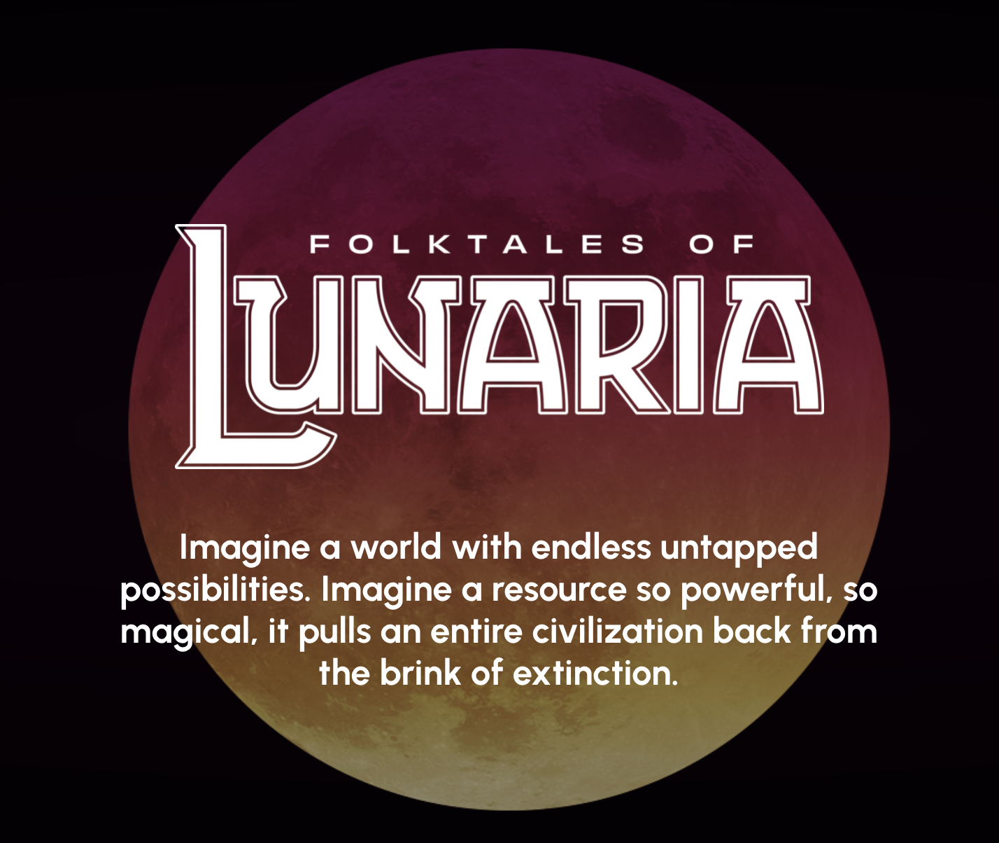
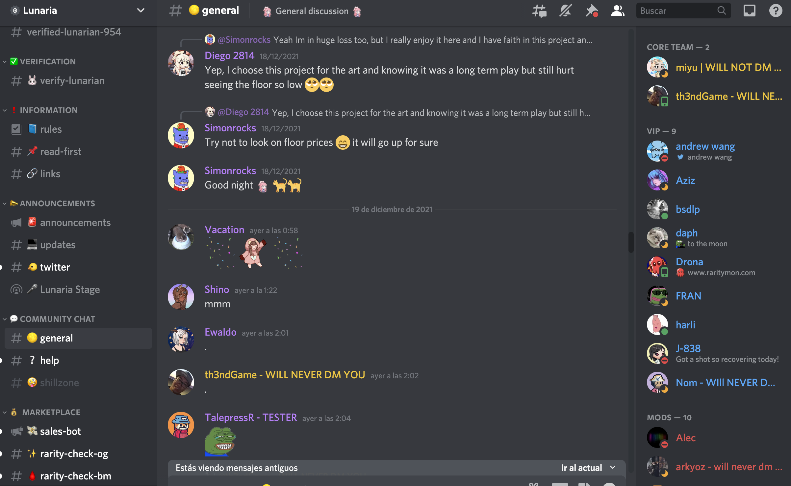
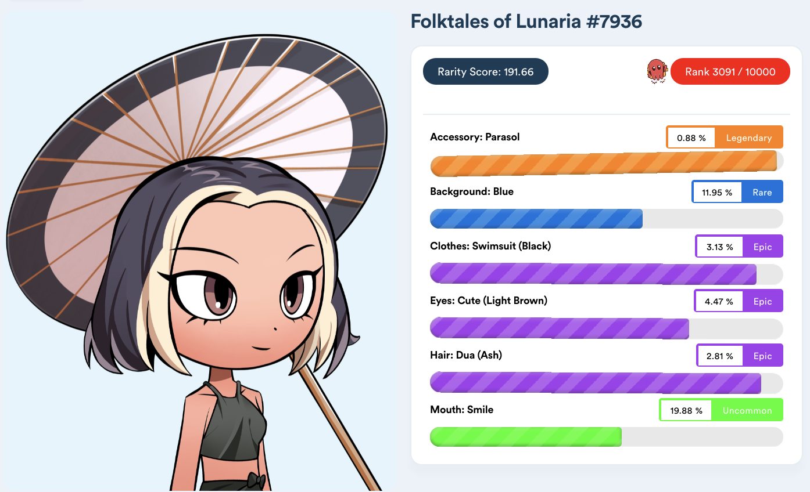
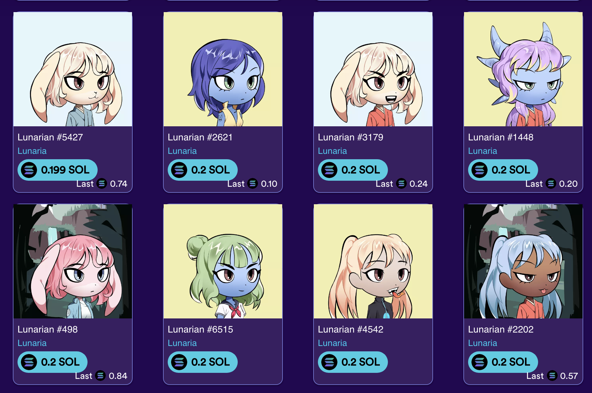
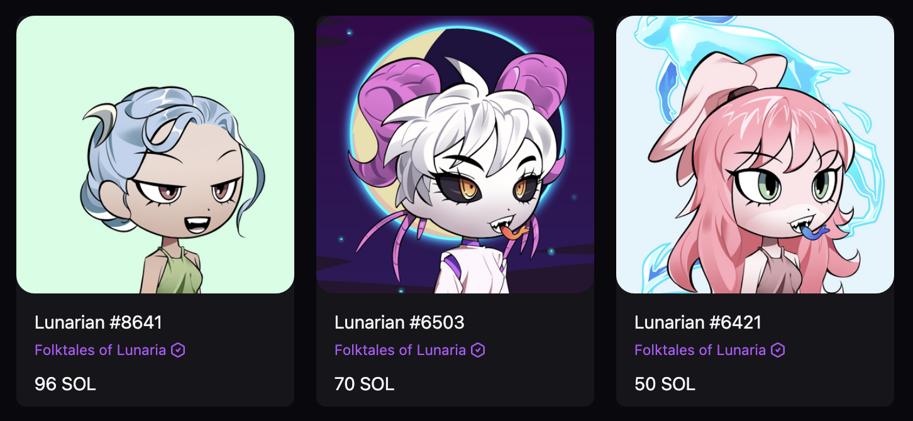

# Lunaria Gift

¡Feliz Navidad 2021! ¡Tu regalo de Navidad 2021 es un NFT, Lunarian #7936, de la colección Folktales of Lunaria!

Esto que lees es la impresión de un fichero README, que explica en qué consiste este regalo y cómo mezcla arte y tecnología.

## Lunarian #7936

---

## ¿Qué es un NFT?

Pensemos en las cryptomonedas primero. Imagina que cada cryptomoneda es como un euro. Todas son iguales entre sí (dos monedas de un euro siempre son iguales y valen lo mismo)y se pueden dividir en céntimos.

Ahora en los NFT. Los NFT son como monedas únicas, cada una diferente. Por tanto, no hay dos iguales, no se pueden dividir, y cada una podría tener un valor diferente. El valor que la gente le de, igual que el arte.

Y así, se pueden crear NFTs para representar lo que uno quiera. Algunos creadores generan NFTs y dicen que representan la propiedad de una obra de arte digital, o de incluso algo físico. Otros creadores generan NFTs para representar tener parte de una colección.

## ¿Qué es Lunarian #7936?

El NFT que te regalo se llama Lunarian #7936. Es parte de una colección de 10,000 Lunarians, creados por un pequeño equipo en Estados Unidos que combina visión, diseño, programación, y marketing.

## ¿Qué es Lunaria?

Investigando proyectos, este me gustó mucho porque su creador cuenta la historia de cómo fue su viaje de una manera que pensé en ti inmediatamente.

Su página web: [https://lunaria.gg/](https://lunaria.gg/)

Folktales of Lunaria es una colección de personajes, llamados Lunarians, que forman parte de un universo inventado por su equipo creador. Puedes aprender más de la historia en su página web.

El proyecto está en continuo desarrollo, con nuevas historias y nuevas sub-colecciones de NFTs siendo creadas. Además, su equipo puede implementar nuevas funcionalidades a lo largo del tiempo que permiten modificar y evolucionar Lunarians.

Los NFTs están implementados sobre Solana, una plataforma blockchain tal como Ethereum, pero más moderna e incluye ciertas mejoras. En Solana, se utilizan el token SOL para realizar transacciones, incluyendo adquirir NFTs. A mediados de diciembre de 2021, 1 SOL equivale a aproximadamente a 160 €.

## ¿Cómo se hace un proyecto así?

"How I Started an NFT Project That SOLD OUT IN 2 MINUTES" por Yoonsup “Locodoco” Choi. [https://www.youtube.com/watch?v=kOOyU1cnkWQ](https://www.youtube.com/watch?v=kOOyU1cnkWQ)

Tener un NFT de una colección es convertirse en parte de su comunidad de coleccionistas. ¡Hay tanta similitud con el arte en el mundo real!

Y es que cada equipo que lleva una colección tiene un Discord en el que forman comunidad.

## ¿Y qué tiene de especial Lunarian #7936?

Pues lo escogí porque es el que más me gustó dentro del rango de precio que estaba mirando, ¡y porque el parasol es muy raro en la colección!

[https://www.raritymon.com/Item-details?collection=lunaria&id=7936](https://www.raritymon.com/Item-details?collection=lunaria&id=7936)

## ¿Cómo es la colección?

Como en todas las colecciones del estilo, cada Lunarian en la colección tiene diferentes valores en su identificador, y cada uno se asocia a una característica visual. Así, existen muchas combinaciones posibles.

¡Algunos Lunarians son muy caros!

Algunos marketplaces:

* [Magic Eden](https://magiceden.io/marketplace/folktales_of_lunaria)
* [Solanart](https://solanart.io/collections/lunaria)

## ¿Cómo te paso tu Lunarian?

Tenemos que hacerlo juntos. Tienes que descargarte [Phantom](https://phantom.app/), una cartera de cryptomonedas y NFTs que se instala en Chrome. Una vez la hayamos instalado y guardado tus claves  de manera segura, te lo transferiré.

## ¿Qué puedes hacer con tu Lunarian?

Aparte de sentirte propietaria de un NFT, puedes:

1. Aprender más del mundo NFTs y de colecciones digitales.
2. Unirte a la comunidad de Discord, y a través de verificar que tienes un Lunarian, unirte a canales privados.
3. Venderlo ahora o más adelante en uno de los portales de NFTs para Solana, como Magic Eden ([https://magiceden.io/](https://magiceden.io/)).

## ¿Cómo está preparado este regalo? 🎁

Este regalo está escrito en formato Markdown, en un repositorio de git y alojado en GitHub. 

* Página web con este contenido: [https://guillermodlpa.github.io/lunaria-gift/](https://guillermodlpa.github.io/lunaria-gift/)
* Código fuente: [https://github.com/guillermodlpa/lunaria-gift](https://github.com/guillermodlpa/lunaria-gift)
